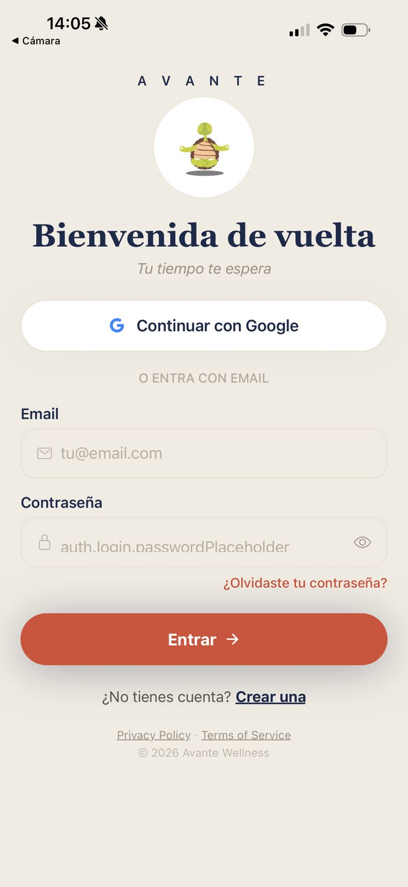
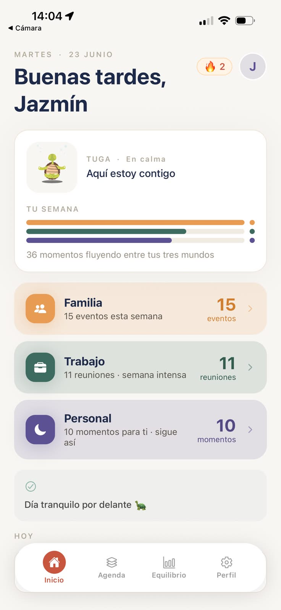
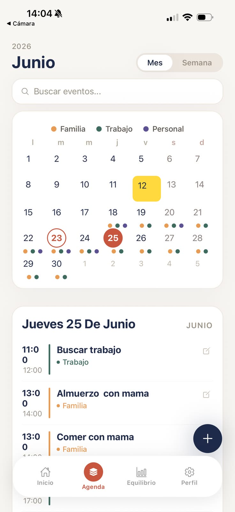
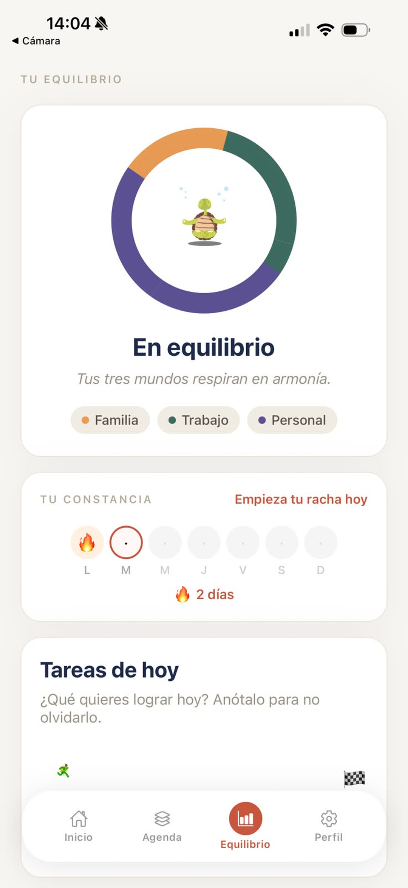

# Avante — Mobile App

[](https://play.google.com/store/apps/details?id=com.jazbedoya.avante)
[](https://expo.dev)
[](https://www.typescriptlang.org/)

Cross-platform mobile app that helps people balance family, work, and personal time with emotional context awareness. **Published on Google Play.**

<p align="center">
  
  
  
  
</p>

## Tech Stack

| Layer | Technology |
|---|---|
| **Framework** | React Native + Expo 54 (managed) |
| **Language** | TypeScript |
| **Navigation** | Expo Router (file-based) |
| **State** | Zustand (auth, events, mascot, context, balance) |
| **Server state** | TanStack Query + persist (AsyncStorage / localStorage) |
| **Forms** | react-hook-form + zod |
| **Styling** | StyleSheet + custom design system tokens |
| **Animations** | Lottie (mascot) + React Native Animated |
| **i18n** | i18next — ES / EN / FR / DE |
| **Auth** | JWT + Google OAuth 2.0 |
| **Analytics** | PostHog (GDPR consent flow) |
| **Crash reporting** | Sentry |
| **Build & Deploy** | EAS Build + Google Play |

## Features

- **3 life areas** — Family, Work, Personal — each with its own calendar view and color
- **Smart Add** — NLP parser that extracts title, day, time, and category from natural text (4 languages)
- **Recurring events** — daily, weekly, monthly with series management
- **Daily tasks** — with streak tracking, celebration overlay (confetti + haptics), and progress path
- **Animated mascot (Tuga)** — 5 Lottie animations, mood-based reactions, customizable name
- **Google Calendar sync** — read-only import via OAuth
- **Energy & mood tracking** — daily check-in via push notification
- **Design system** — custom tokens (colors, spacing, typography, shadows, radius)
- **Offline-first** — TanStack Query persistence with 24h cache
- **Accessibility** — roles, labels, and states on interactive elements

## Architecture

```
src/
├── features/
│   ├── auth/        # Login, signup, Google OAuth
│   ├── events/      # CRUD, QuickAddSheet, SmartAddSheet, conflict detection
│   ├── tasks/       # DailyTasksSection, TodayPath, CelebrationOverlay, streak
│   ├── home/        # Greeting, TugaCard, NextEventCard, TasksSummaryCard
│   ├── overview/    # AreaCalendarScreen, EventDetailSheet, EventRow
│   ├── mascot/      # TugaAnimation (Lottie), mascotStore, getMascotState
│   ├── calendar/    # Google Calendar sync hooks & store
│   ├── context/     # Energy/mood tracking, DayCheckSheet
│   └── balance/     # Balance targets per area
├── i18n/            # 4 languages, date locale helpers
├── theme/           # Design system (colors, spacing, typography, shadows, radius)
├── stores/          # Auth, celebration settings, analytics consent
├── lib/             # API client (axios), analytics wrapper
└── components/      # AnalyticsConsentSheet
```

## Screens

| Screen | Description |
|---|---|
| **Home** | Greeting, mascot card, 3 area cards, tasks summary, next event |
| **Agenda** | Monthly/weekly calendar, event timeline, search, FAB with Smart Add |
| **Balance** | Area selector, weekly intentions, task tracking with streak |
| **Profile** | Mascot settings, Google Calendar, language picker, about |

## Running locally

```bash
# Install dependencies
npm install

# Start Expo dev server
npx expo start --port 8085

# Scan QR with Expo Go (phone) or press 'a' for Android emulator
```

Requires the [backend API](https://github.com/jazbedoya/calendario_backend) running.

## Build & Deploy

```bash
# Production AAB (Google Play)
npx eas build --platform android --profile production

# Submit to Google Play
npx eas submit --platform android
```

## Backend

REST API in a separate repo: [calendario_backend](https://github.com/jazbedoya/calendario_backend)

---

Built by **Jazmín Bedoya** — [GitHub](https://github.com/jazbedoya)
